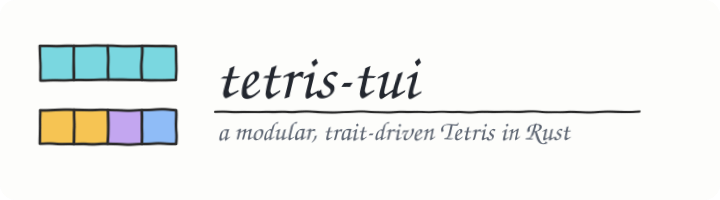
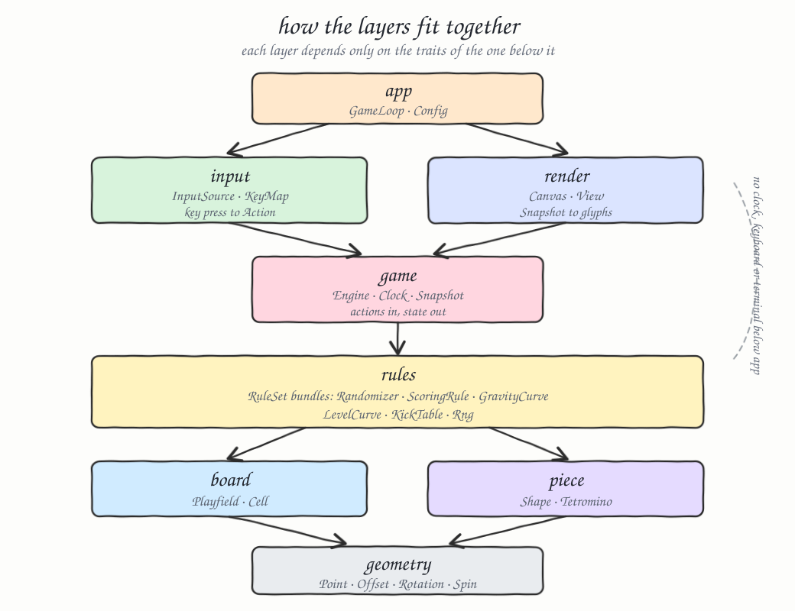
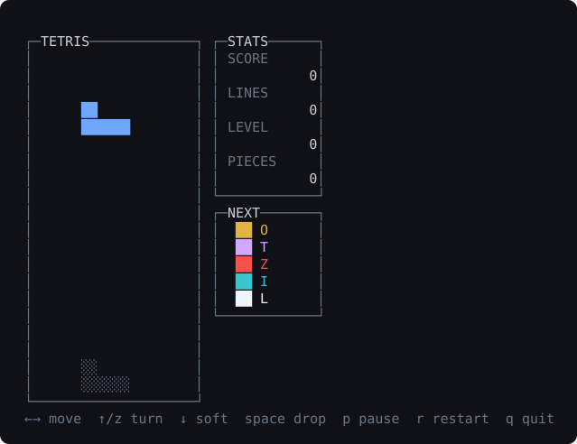
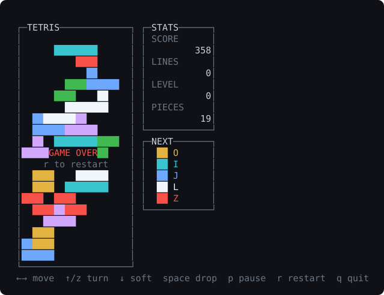

A complete Tetris that runs in your terminal, written in Rust 2024 as an exercise in
keeping a game honest: every rule that could reasonably differ between variants sits
behind a trait, every layer depends only on the traits of the layer below it, and the
entire game — including what gets drawn — is playable inside a test with no terminal,
no clock and no keyboard.

Built with [`cargo-pretty`](https://github.com/romancitodev/cargo-pretty) for build,
run and test output.

## How It Works

The engine never reads a clock or a keyboard. Time arrives through `Engine::tick(Duration)`
and player intent through `Engine::apply(Action)`, so a whole game is a pure function of
its inputs. Each frame the loop asks an `InputSource` for an action, asks a `Clock` how
much time passed, advances the engine, and paints a `Snapshot` onto a `Canvas`.

In the terminal those three traits are crossterm, the system clock and a diffing terminal
writer. In a test they are a scripted list of actions, a clock the test advances by hand,
and an in-memory canvas the test reads back character by character. The loop itself is the
same code in both cases, which is why the 281 tests cover the rendering too and not just
the rules.

Chance, reward and pace live in `RuleSet`: the seven-bag randomizer, the scoring table, the
gravity curve, the level curve and the rotation kick table. Swapping any of them is a new
implementor, not an edit to the engine.

## Architecture



Arrows point from a layer to what it uses. Nothing below `app` touches a clock, a keyboard
or a terminal — that boundary is what makes the rest testable.

| Layer | Traits it defines | Responsibility |
|---|---|---|
| `geometry` | — | `Point`, `Offset`, `Rotation`, `Spin` |
| `piece` | `Shape` | The seven tetrominoes and their rotating footprints |
| `board` | `Playfield` | The locked stack, collision, row collapse |
| `rules` | `RuleSet`, `Randomizer`, `ScoringRule`, `GravityCurve`, `LevelCurve`, `KickTable`, `Rng` | Everything a variant might change |
| `game` | `Clock` | `Engine`, `Action`, `Snapshot`, `Phase`, `Stats` |
| `render` | `Canvas`, `View` | Panels painting a snapshot into glyphs |
| `input` | `InputSource`, `KeyMap` | Key press to `Action` |
| `app` | — | `GameLoop`, argument parsing, terminal setup |

## Features

- **Seven-bag randomizer** — every tetromino appears once before any repeats, so the worst-case
  drought is twelve pieces instead of unbounded. A test asserts that bound over 700 pieces.
- **Ghost piece** — shows exactly where a hard drop will land, and a test asserts the piece
  really does land on the cells the ghost promised.
- **Wall kicks** — a blocked rotation retries a short ordered list of nearby offsets, so pieces
  turn while flush against a wall instead of feeling broken.
- **Guideline scoring** — a Tetris pays more than four singles, so stacking high is worth the risk.
- **Level progression** — one level per ten rows, each level faster, with a floor so the interval
  never reaches zero and the game stays playable.
- **Pause and restart** — pause freezes gravity; a finished game can always be restarted, and
  neither can be reached by accident from the other.
- **Reproducible games** — `--seed N` replays an exact piece sequence, which is how a failing
  game becomes a test.
- **Flicker-free rendering** — a double buffer writes only the cells that changed.
- **Terminal restored on panic** — raw mode is undone in `Drop`, so a crash never leaves an
  unusable shell.

## Stack

| Choice | Why |
|---|---|
| Rust 1.98, edition 2024 | The toolchain is pinned in `rust-toolchain.toml` so the build is reproducible. |
| `crossterm` 0.29 | The only runtime dependency. Raw mode, key events and the alternate screen are not worth hand-rolling across platforms. |
| No TUI framework | Rendering is a `Canvas` trait and a handful of panels, roughly 400 lines, which keeps the visual layer testable and dependency-free. |
| No RNG crate | A 20-line xorshift64\* we own, so piece sequences are seedable and reproducible. |
| `cargo-pretty` | Live build, run and test output. A dev tool, not a dependency — the crate builds fine without it. |

## Interface

There is no network API. The program is a CLI, and the crate is a library.

```
tetris-tui [--seed N] [--columns N] [--rows N]

  --seed N     replay a specific piece sequence
  --columns N  board width  (default 10, minimum 4)
  --rows N     board height (default 20, minimum 6)
  --help       show usage
```

Exit codes: `0` normal, `1` runtime error (for example a terminal too small), `2` bad argument.

| Key | Action |
|---|---|
| `←` `→` | Move left / right |
| `↑` or `x` | Rotate clockwise |
| `z` | Rotate counter-clockwise |
| `↓` | Soft drop |
| `space` | Hard drop |
| `p` | Pause / resume |
| `r` | Restart |
| `q`, `Esc`, `Ctrl-C` | Quit |

The library surface, for driving a game yourself:

```rust
use tetris::board::Board;
use tetris::game::{Action, Engine};
use tetris::rules::StandardRules;
use std::time::Duration;

let mut engine = Engine::new(Board::standard(), StandardRules::seeded(42));
engine.apply(Action::MoveLeft);
engine.apply(Action::HardDrop);
engine.tick(Duration::from_millis(800));

let snapshot = engine.snapshot();
println!("score {}", snapshot.stats.score);
```

## Key Data Structures and Design Decisions

**Moves return candidates, they do not mutate.** `ActivePiece::shifted` and `::spun` return a new
piece. The engine builds a candidate, asks the board whether it fits, and keeps it only if it does,
so an illegal move costs nothing to try and can never leave a piece half-moved.

**A filled cell remembers its tetromino.** `Cell::Filled(Tetromino)` rather than a boolean means the
renderer gets the colour for free, and there is no parallel colour grid to drift out of sync with
the occupancy grid.

**`RuleSet` bundles five traits behind one generic.** `Engine<R: RuleSet>` takes a single type
parameter instead of five, keeping the signature readable while every rule stays individually
replaceable through the associated types.

**`Snapshot` decouples rendering from the engine's generics.** The engine is generic over its rule
set; the snapshot is not. Taking one picture per frame keeps every view free of those generics and
guarantees a frame is drawn from one consistent moment.

**The canvas is a trait, so the renderer is testable.** `TextCanvas` collects glyphs in memory and
hands back plain strings; `TerminalCanvas` diffs against the previous frame and writes only what
changed. Views target the trait and never learn which one they are drawing to.

**Signed coordinates, unsigned board.** `Point` is `i16` because rotation kicks probe positions that
are briefly out of bounds; `Playfield::is_free` treats anything outside the field as occupied, which
is what makes walls and the floor fall out of one rule instead of three.

**Time accumulates, it is not truncated.** `Engine::tick` carries the remainder forward, so a slow
frame still applies every gravity step it was owed rather than silently losing them.

## Screens

The screenshots below are the real renderer's output, captured through the public API by
`examples/capture.rs` and converted to SVG — not mockups.

### Playing



A fresh seeded game a couple of seconds in. The blue J piece has fallen two rows under gravity, and
the dim `░` blocks at the bottom are the ghost showing exactly where a hard drop would put it. The
`STATS` panel is still at zero; `NEXT` lists the five upcoming pieces, each in its own colour so the
queue is readable at a glance.

### Mid-game


After 28 pieces have been packed across the board. Every locked cell keeps the colour of the piece
that made it, which is the `Cell::Filled(Tetromino)` decision paying off. `SCORE` and `PIECES` have
climbed from the hard-drop rewards.

### Paused


Pressing `p` freezes gravity and paints the overlay on top of the board. The panel is drawn last so
it always wins the overlap, and the banner names the key that undoes it — a paused game can never
trap the player.

### Game over



The stack reached the spawn row and a new piece could not fit. Movement is ignored from here, but
`r` and `q` keep working. The board is left on screen rather than cleared, so the player can see how
they lost.

## How to Run

```bash
./scripts/setup.sh        # toolchain components, cargo-pretty, dependencies
./scripts/run.sh          # play
./scripts/run.sh --seed 42 --columns 12 --rows 22
```

Or straight from cargo:

```bash
cargo pretty run --release        # falls back to: cargo run --release
```

The default board needs a terminal of at least 67x24. A smaller one exits with a message
saying what it needed rather than drawing a broken screen.

## How to Test

```bash
./scripts/test-all.sh     # formatting, clippy with -D warnings, then every test
```

281 tests: 254 unit tests beside the code they cover, 26 integration tests in `tests/`, and a
documented usage example that runs as a doctest. The integration tests play whole games and assert
invariants — pieces never overlap the stack, a locked piece
adds exactly four cells unless a row cleared, the score never decreases, a game left running
always ends, and a rendered screen never writes outside the size it asked for.

```bash
cargo pretty test                 # or: cargo test
cargo test --test gameplay        # whole games, no terminal
cargo test --test rendering       # the visual layer, character by character
cargo run --example capture       # re-capture the screenshots above
```

## Scripts

All scripts live in `scripts/` and run from any directory of the repository.

| Script | What it does |
|---|---|
| `./scripts/setup.sh` | Installs toolchain components, `cargo-pretty` and dependencies |
| `./scripts/build.sh` | Builds the game (`debug` by default, or `release`) |
| `./scripts/run.sh` | Plays the game, passing any arguments through |
| `./scripts/test-all.sh` | Runs formatting, clippy and every test suite |
| `./scripts/lint.sh` | Checks formatting and clippy; `--fix` applies both |
| `./scripts/status.sh` | Prints the toolchain, tooling and build state |
| `./scripts/clean.sh` | Removes build artifacts |

Every script uses `cargo pretty` when it is installed and the output is a terminal, and falls
back to plain `cargo` otherwise, so the same scripts work in CI.

```bash
./scripts/setup.sh
./scripts/status.sh
./scripts/test-all.sh
./scripts/run.sh
```

## License

MIT
